# Worksheet 1 - OSCAR LINEHAN 21015730


# Worksheet 1

The purpose of this task was to examine log lines for the desired format. Each entery refers to a severity, enclosed in brackets (e.g., `[INFO], [WARNING], [ERROR]`),  followed by (": "), and then the content of the log. If the log line deviates from this format, the tool will yield an empty string, indicating an unsuccessful message extraction.

# Task 1

### Part 1

in part1, I Implemented a function in the main file to extract the message from a log line.

`std::string line(const std::string& logLine);`

The function of the log line if it matches the expected format. Otherwise, it returns an empty string.

`std::string`: This indicates the return type of the function. In this case, it specifies that the function will return an object of type `std::string`, which is a C++ standard library string class.

`line`: This is the name of the function. In C++, functions are usually named to reflect their purpose. Here, it suggests that the function is related to processing lines of text.

`(const std::string& logLine)`: This part is the parameter list enclosed within parentheses. It specifies the input parameters that the function expects.

`const std::string&`: This indicates that the parameter `logLine` is a reference to an object of type `std::string`. A reference means that the function cannot modify the contents of `logLine`, but it can access it without making a copy.

Result: It Returns the message of the log line if it matches the expected format. Otherwise, it returns an empty string

To evaluate the `'line'` function,  we execute the function as follows:
  `std::cout << "Error Message: " << errorMessage << std::endl;`

implementation:

```cpp
std::string Log::line() {
    std::string currentLine;
    
    if (std::getline(logFile, currentLine)) {
        return currentLine;
    } else {
        return "";
    }
```

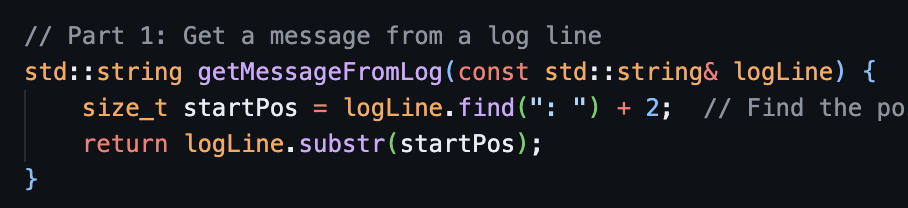

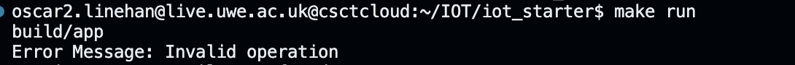

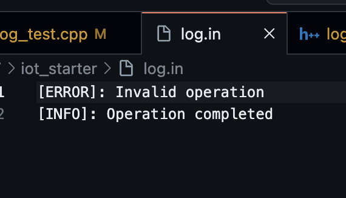

# Part 2

Next, I worked on the ‘`level’` function, this function is specialized for log entries following a specific structure. Each log entry begins with a severity level enclosed in brackets ([INFO], [WARNING], [ERROR]), followed by a colon and space (": "), and then the log message. Its  task is to inspect the log entry to ensure the correct format is present and properly ordered, aiming to extract the severity level.

To complete Task 2, I created these files:

1. Generated three files: `log.hpp`, `log.cpp`, and `main.cpp`.
2. Created the `Log` class within `log.hpp` and `log.cpp`, defining its constructor, destructor, and various member functions, such as `create_log`, `next`, `line`, `level`, and `reformat`.
3. Modified the makefile to include `log.hpp`, `log.cpp`, and `main` in the compilation process.
4. Implemented `main.cpp` to test the functionalities of the `Log` class.
5. Updated the makefile to add a new rule for including `app2` in the compilation process.

Summary of the three files:

- `log.hpp`: This header file contains the declaration of the `Log` class and its associated member functions.
- `log.cpp`: This source file provides the implementation of the `Log` class, including the definitions of the constructor, destructor, and the member functions declared in `log.hpp`.
- `main.cpp`: This test file was created to verify the functionalities of the `Log` class. It includes `log.hpp` and contains the `main` function, which creates instances of the `Log` class to manage log files.

Function Overview: `level`
`std::string level(const std::string& message);`
Objective: Extract and return the severity level portion of the log entry.
Format Requirement: The function anticipates log entries to comply with the "`[LEVEL]: MESSAGE"` format.

Result:
The function returns a string containing the severity level of the log if the entry conforms to the specified format. Also, it returns an empty string if the entry fails to meet the defined condition.

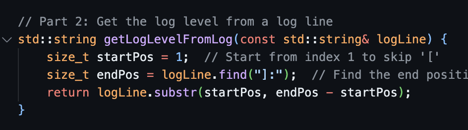

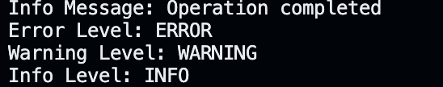

`std::string getLogLevelFromLog(const std::string& logLine) {`: Declares a function named `getLogLevelFromLog` that takes a constant reference to a string `logLine` as its parameter and returns a string.

`size_t startPos = 1;`: This line initializes a variable `startPos` with the value 1. It describes the starting index for extracting the log level. It starts from index 1 to skip the '[' character in the log line.

`size_t endPos = logLine.find("]:");`: This line finds the position of the substring "]:", which marks the end of the log level in the `logLine`. The `find` function searches for the substring within the `logLine`. It returns the position of the first occurrence of the substring or `std::string::npos` if the substring is not found.

`return logLine.substr(startPos, endPos - startPos);`: This extracts the substring from `logLine` starting from the `startPos` index (which skips the '[' character) to the position just before the end position of the log level (`endPos`). It then returns this substring, which represents the log level.

implementation:

```cpp
std::string Log::level() {
    std::string currentLine;
    
    if (std::getline(logFile, currentLine)) {
        size_t startPos = currentLine.find('[');

        size_t endPos = currentLine.find(']', startPos);

        if (startPos != std::string::npos && endPos != std::string::npos) {
            
            return currentLine.substr(startPos + 1, endPos - startPos - 1);
        } else {
            return ""; 
        }
    } else {
        return ""; 
    }
}
```

# Part 3

This function modifies the log message by combining the recognized level and message segments. It expects the log line to follow the format "[LEVEL]: MESSAGE". The function returns a string presenting the reformatted log message

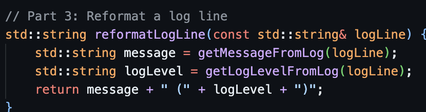

'reformat' function:
`std::string reformat(const std::string& message);`

This function, is designed to interpret and alter log lines that are structured as `”[LEVEL]:MESSAGE"`.

`std::string message = getMessageFromLog(logLine);`: This line calls the function named `getMessageFromLog` to extract the message part from the `logLine` and stores it in a string variable `message`.

`std::string logLevel = getLogLevelFromLog(logLine);`: This line calls a function named `getLogLevelFromLog` to extract the log level from the `logLine` and stores it in a string variable named `logLevel`.

`return message + " (" + logLevel + ")";`: This line constructs a new string by merging the `message` and the `logLevel`, . This reformatted string is then returned from the function.

Implementation:

```cpp
std::string Log::reformat() {
    std::string currentLine;

    if (std::getline(logFile, currentLine)) {
        size_t startPos = currentLine.find('[');
        size_t endPos = currentLine.find(']', startPos);

        if (startPos != std::string::npos && endPos != std::string::npos) {
            std::string logLevel = currentLine.substr(startPos + 1, endPos - startPos - 1);

            std::string logMessage = currentLine.substr(endPos + 1);
            
            return logMessage + " (" + logLevel + ")";
        } else {
            return currentLine; 
        }
    } else {
        return "";
    }
}
```

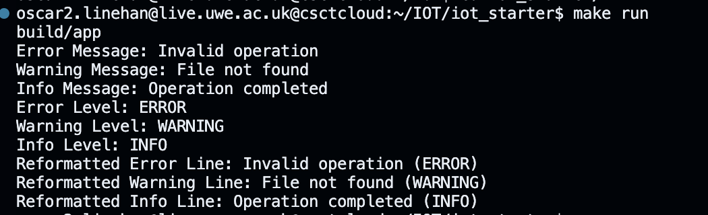

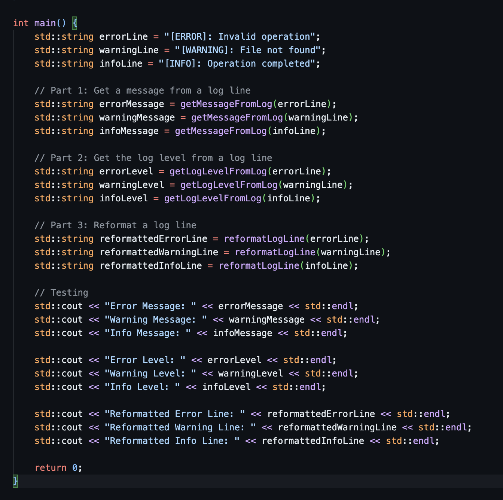

# TASK 2

For task 2 I implemented log class functionality. 

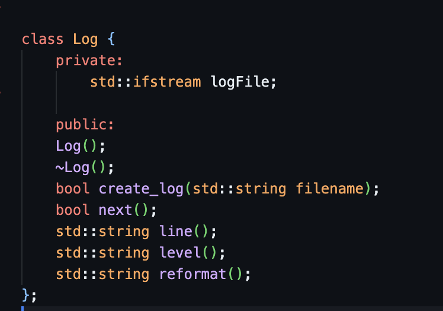

1. Generated three files: `log.hpp`, `log.cpp`, and `main.cpp`.
2. Defined the Log class in `log.hpp` and `log.cpp`, incorporating its constructor, destructor, and various functions such as `create_log`, `next`, `line`, `level`, and `reformat`.
3. Updated the makefile to include `log.hpp`, log.cpp, and `main.cpp` in the compilation process.
4. Implemented `main.cpp` to test the Log class functionality.
5. Modified the makefile to include a new rule for incorporating app2 in the compilation process.

Summary of the three files:

`log.hpp`: This header file contains the declaration of the Log class and its associated member functions.

`log.cpp`: In this source file, the implementation of the Log class is provided, including the definitions of the constructor, destructor, and member functions declared in log.hpp.

`main.cpp`: This test file is designed to evaluate the functionalities of the Log class. It includes log.hpp and contains the main function, which creates instances of the Log class to manage log files.

# Part 3

Updating the Makefile involved  adjustments to update compilation of new files:

1. The `CPP_SOURCES` variable was modified to include `./src/log.cpp`
2.  `CPP_HEADERS` were updated to include `./src/log.hpp`
3. A new build  for `app2`  `((BUILDDIR)/(BUILD_DIR)/(BUILDDIR)/(APP2))`  to ensure compile of the Log class's test program, the `main2.cpp`

The Makefile was updated as follows to accommodate these changes:

```
$(BUILD_DIR)/$(LOGAPP): main2.cpp $(OBJECTS) Makefile
	$(ECHO) linking app 2 $<
	$(CC) $(CPPFLAGS) $(LDFLAGS) -o $@ ./src/main2.cpp $(OBJECTS)
	$(ECHO) logapp successsfully compiled
```

This addition ensures that the test application for the Log class undergoes proper compilation and linking.

I successfully compiled the unit tests after including simpletest. 

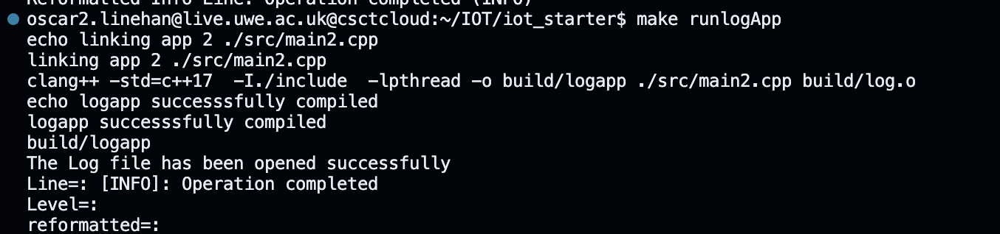

after compiling the are now 2 executables, app and logapp.

git submodule add [https://github.com/kudaba/simpletest.git](https://github.com/kudaba/simpletest.git)

I initated the submodule to complete unit tests, leading to the creation of a new directory named "simpletest" at the project's root. Within this "simpletest" directory reside the files simpletest.cpp and simpletest.h.

In order to conduct unit testing, I authored a file named `log_test.cpp,` located within the 'src' directory, and included the header file simpletest.h.

## Makefile Adjustments

I appended the test file location to a variable for test sources.

`TESTERS_SOURCES = ./src/log_test.cpp`

Another variable was established to hold the file paths for supplementary source files essential for testing. In this instance, it points to simpletest.cpp.

`TEST_MODULE = ./simpletest/simpletest.cpp`

I formulated a collection of object files associated with the test source files, utilizing 'notdir' to exclude directory components and 'addprefix' to add the build directory to each object file.

```python
UNITTEST_OBJECTS = $(addprefix $(BUILD_DIR)/,$(notdir $(TESTERS_SOURCES:.cpp=.o)))
SUB_MODULE_OBJECTS = $(addprefix $(BUILD_DIR)/,$(notdir $(TEST_MODULE:.cpp=.o)))

```

Targets and Rules:

I defined a target outlining dependencies required for building the test application, ensuring the presence of the build directory and mandating the creation of both the main and test applications.

`testapp: $(BUILD_DIR) $(BUILDDIR)/$(BUILD_DIR)/$(BUILDDIR)/$(APP_TESTER) $(BUILDDIR)/$(BUILD_DIR)/$(BUILDDIR)/$(APP_TESTER)`

A target specifying the command for running the unit test application was established. It compiles the unit test application before execution.

`runlogApp:$(BUILDDIR)/$(BUILD_DIR)/$(BUILDDIR)/$(LOGAPP)$(BUILDDIR)/$(BUILD_DIR)/$(BUILDDIR)/$(LOGAPP)`

Compilation Rule:

This rule compiles the source file simpletest.cpp into an object file, ensuring the presence of the build directory and necessary dependencies.

`$(BUILD_DIR)/simpletest.o: $(TEST_MODULE) Makefile | $(BUILD_DIR)
    $(CC) -c $(CPPFLAGS) $< -o $@`

Linking Rule:

Finally, a rule was established to link the test application using the object files generated from the test source files, the main object files, and the simpletest.o object file.

`$(BUILDDIR)/$(BUILD_DIR)/$(BUILDDIR)/$(APP_TESTER): $(UNITTEST_OBJECTS) $(OBJECTS) $(BUILD_DIR)/simpletest.o Makefile
    $(CC) $(CPPFLAGS) $(LDFLAGS) -o $@ $(UNITTEST_OBJECTS) $(OBJECTS) $(BUILD_DIR)/simpletest.o`

After running `make runtestapp`

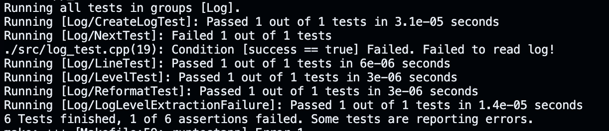

I can see that 1/6 assertions had failed. The one that has failed is 

```python
DEFINE_TEST_G(NextTest, Log) {
    Log log;
    log.create_log("../log.in");
    bool success = log.next();
    TEST_MESSAGE(success == true, "Failed to read log!");
}
```