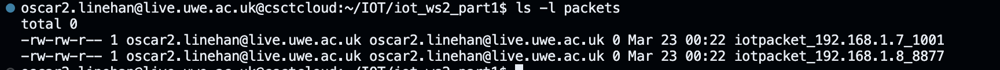
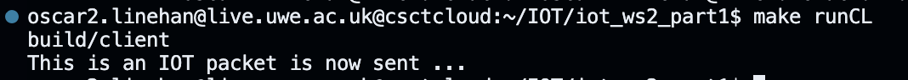
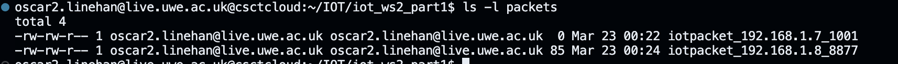
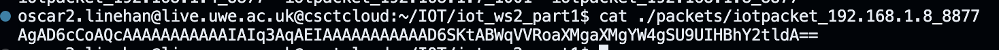
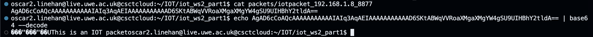
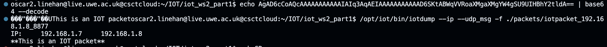
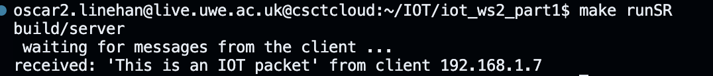
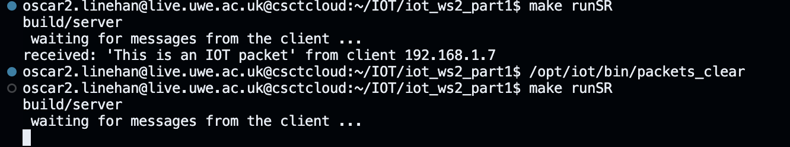
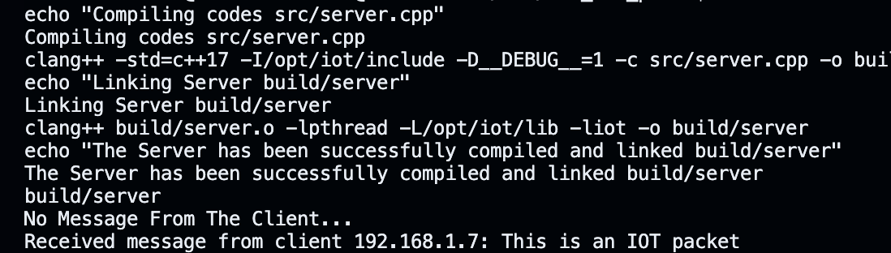

# Worksheet2_1 - OSCAR LINEHAN -21015730


# TASK 1

### **Client Compilation Process:**

1. **Client Setup**:
    - Configure IP addresses and port numbers:
        - Client's IP address: 192.168.1.7
        - Client's port: 1001 (address bound to this socket)

1. **Server set up:**
    - Configure server IP and ports
        - Server's IP: 192.168.1.8 (message destination)
        - Server's port: 8877

## **Makefile Adjustments**:

I revamped the makefile to specify the build 

1. **Compiler and Linker Configuration**:
    - **`CC`**: Specifies the C++ compiler as **`clang++`**.
    - **`LD`**: Specifies the linker as **`clang++`**.
2. **Compiler Flags**:
    - **`CPPFLAGS`**: Contains compiler flags including:
        - **`std=c++17`**: Sets the C++ standard to C++17.
        - **`I/opt/iot/include`**: Specifies the directory for C++ header files.
        - **`D__DEBUG__=1`**: Defines a preprocessor macro **`__DEBUG__`** with a value of **`1`**.
    - **`LDFLAGS`**: Contains linker flags including:
        - **`lpthread`**: Links the POSIX threads library.
        - **`L/opt/iot/lib`**: Specifies the directory for library files.
        - **`liot`**: Links a library named **`iot`**.
3. **Directory and File Settings**:
    - **`ROOTDIR`**, **`ECHO`**, **`CP`**: Variables used for directory and file manipulation.
    - **`SOURCE_DIR`**: Specifies the directory containing source files (**`src`**).
    - **`BUILD_DIR`**: Specifies the directory for object files (**`build`**).
    - **`CLIENT_SOURCE_FILE`**, **`SERVER_SOURCE_FILE`**: Paths to client and server source files.
    - **`APP1`**, **`APP2`**: Names of the client and server applications.
4. **Object Files**:
    - **`CLIENT_OBJECTS`**, **`SERVER_OBJECTS`**: Lists of object files for the client and server, respectively.
5. **Build Targets**:
    - **`all`**: Default target. Compiles both the client and server applications.
    - **`runCL`**, **`runSR`**: Targets to execute the client and server applications after compilation.
    - **`$(BUILD_DIR)/$(APP1)`**, **`$(BUILD_DIR)/$(APP2)`**: Rules to link the client and server applications.
    - **`$(BUILD_DIR)/%.o`**: Rule to compile any **`.cpp`** file in the **`SOURCE_DIR`** to an object file in the **`BUILD_DIR`**.
    - **`$(BUILD_DIR)/client.o`**: Rule specifically for compiling **`client.cpp`** to **`client.o`**.
6. **Directories Creation**:
    - **`$(BUILD_DIR)`**: Rule to create the **`BUILD_DIR`** if it doesn't exist.
7. **Clean Target**:
    - **`clean`**: Removes compiled binaries and object files.
8. **Phony Target**:
    - **`.PHONY`**: Specifies targets that are not files. This prevents conflicts with filenames.

```python
CC = clang++
LD = clang++

CPPFLAGS = -std=c++17 -I/opt/iot/include -D__DEBUG__=1
LDFLAGS = -lpthread -L/opt/iot/lib -liot

ROOTDIR = ./
ECHO = echo
CP = cp

SOURCE_DIR = src
BUILD_DIR = build

# Let's Specify source files for each application
CLIENT_SOURCE_FILE = $(SOURCE_DIR)/client.cpp
SERVER_SOURCE_FILE = $(SOURCE_DIR)/server.cpp

# We are not using Headers yet
CPP_HEADERS = 

APP1 = client
APP2 = server

# Object files for each app
CLIENT_OBJECTS = $(addprefix $(BUILD_DIR)/, $(notdir $(CLIENT_SOURCE_FILE:.cpp=.o)))
SERVER_OBJECTS = $(addprefix $(BUILD_DIR)/, $(notdir $(SERVER_SOURCE_FILE:.cpp=.o)))

vpath %.cpp $(SOURCE_DIR)

all: $(BUILD_DIR) $(BUILD_DIR)/$(APP1) $(BUILD_DIR)/$(APP2)

runCL: $(BUILD_DIR)/$(APP1)
	$(BUILD_DIR)/$(APP1)

runSR: $(BUILD_DIR)/$(APP2)
	$(BUILD_DIR)/$(APP2)

$(BUILD_DIR)/$(APP1): $(CLIENT_OBJECTS)
	$(ECHO) "Linking Clients $@"
	$(CC) $(CLIENT_OBJECTS) $(LDFLAGS) -o $@
	$(ECHO) "The client has been successfully compiled and linked  $@"

$(BUILD_DIR)/$(APP2): $(SERVER_OBJECTS)
	$(ECHO) "Linking Server $@"
	$(CC) $(SERVER_OBJECTS) $(LDFLAGS) -o $@
	$(ECHO) "The Server has been successfully compiled and linked $@"

# Compiling .cpp files to .o
$(BUILD_DIR)/%.o: $(SOURCE_DIR)/%.cpp $(CPP_HEADERS) | $(BUILD_DIR)
	$(ECHO) "Compiling codes $<"
	$(CC) $(CPPFLAGS) -c $< -o $@

# Compile client.cpp into client.o
$(BUILD_DIR)/client.o: $(SOURCE_DIR)/client.cpp $(CPP_HEADERS) | $(BUILD_DIR)
	$(ECHO) "Compiling client.cpp"
	$(CC) $(CPPFLAGS) -c $< -o $@

$(BUILD_DIR):
	mkdir -p $@

clean:
	-rm -fR $(BUILD_DIR)/$(APP1) $(BUILD_DIR)/$(APP2) $(BUILD_DIR)/*.o

.PHONY: clean all

```

, I created a folder called "packets" and generated packet files for both the client and server using the provided utility.

1. Created a folder named "packets":

`mkdir packets` I then created a packet for the client, 

`/opt/iot/bin/create_packetfile 192.168.1.7 1001` which created a empty packet in my packets directory. I repeated this for the server, `/opt/iot/bin/create_packetfile 192.168.1.8 8877` 



This indicated that they where created but do not contain any data. I ran the client via `make runCL`which indicated a packet was being sent.



I then reran `ls -l packets`: 



which now states 85 bytes.  



I used cat to retrieve the IOT packet and using `echo AgAD6cCoAQcAAAAAAAAAAAIAIq3AqAEIAAAAAAAAAAAD6SKtABWqVVRoaXMgaXMgYW4gSU9UIHBhY2tldA== | base64 --decode` i can decode the packet from base64 which gave me the output, `���"���"��UThis is an IOT packet` 



## Packet Dump:

The command **`/opt/iot/bin/iotdump --ip --udp_msg -f ./packets/iotpacket_192.168.1.8_8877`** analyzes and displays information about IP addresses and UDP messages contained in the packet file.



## Clearing created packets:

Here is the packet when I ran the server via make runSR



To test if the server and client where communicating correctly I used `/opt/iot/bin/packets_clear` to remove all packets and then ran the server again.



As you can see the is no message meaning they are communicating. 

# TASK 2

## Building a UDP Client-Server System

1. **Update Makefile:**
Update the source files in the Makefile for Task 2:
`CLIENT_SOURCE_FILE = $(SOURCE_DIR)/client_udp.cpp
SERVER_SOURCE_FILE = $(SOURCE_DIR)/serverudp.cpp`
2. **Clean the Build:**
Clean using the command`make clean`
3. **Clear Packet Files:**
Clear packet files are cleared before recompiling , using `/opt/iot/bin/packets_clear`
4. **Recompile:**
Recompile the build folder using`make runCL` and `make runSR`

### client.cpp changes

```python
 // ##########  Receive echoed message from the server  ##########
    char buffer[800];
    memset(buffer, 0, sizeof(buffer));
    sockaddr_in received_from;
    socklen_t received_from_len = sizeof(received_from);
    size_t addrlen = received_from_len;  // Ensure addrlen is of type size_t
    len = sock.recvfrom(buffer, sizeof(buffer), 0, (sockaddr*)&received_from, &addrlen);
    if (len > 0) {
        std::cout << "Received from server: " << buffer << std::endl;
    }

```

I added code to receive the echoed message from the server using recvfrom() function and then print the echoed message from the server to the console.

## server.cpp changes

```python
  // ##########  Receiving data from the client  ##########
    std::cout << "Waiting for messages from the client ...\n";
    while (true) {
        memset(buffer, 0, sizeof(buffer)); // Clearing the buffer
        // Wait for data to be received from the client
        sock.recvfrom(buffer, sizeof(buffer), 0, (sockaddr*)&the_client_addr, &the_client_addr_len);
        // Display the received message from the client
        printf("Received: '%s' from client %s\n", buffer, inet_ntoa(the_client_addr.sin_addr));
    }
    return 0;
```

The while loop ensures that the server continues to run continually and supports any number of clients.

After adding this functionality, the echoed message from the server using`recvfrom()`function returns and then print the echoed message from the server to the console.



## **Worksheet2_1 complete**