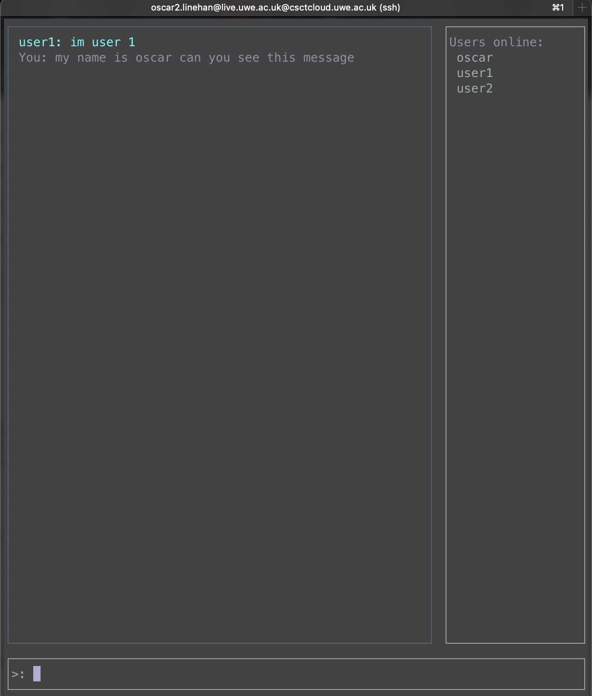
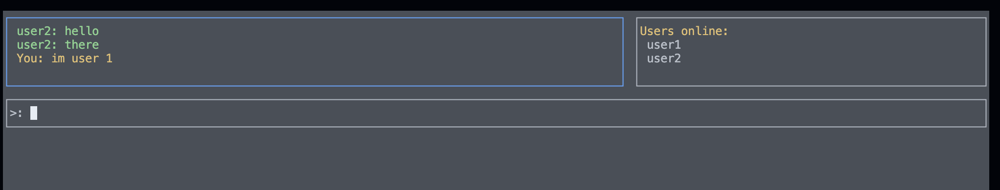
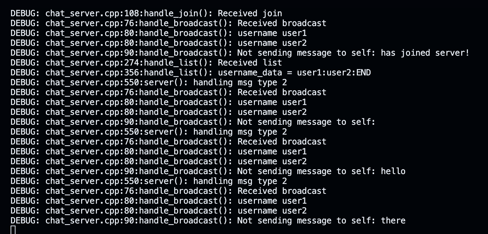
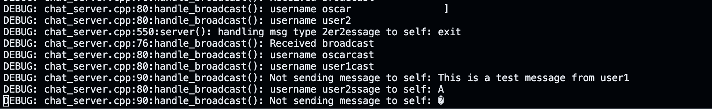
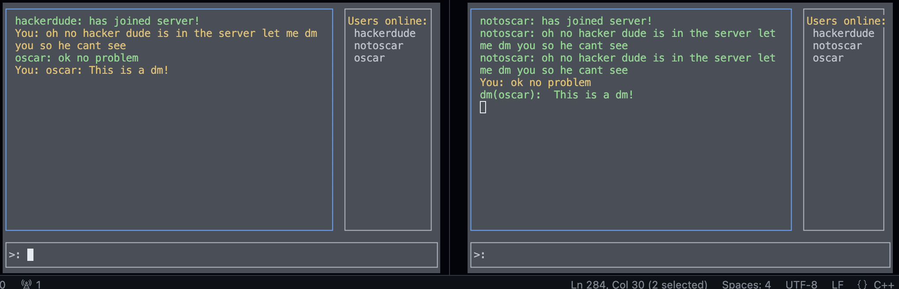
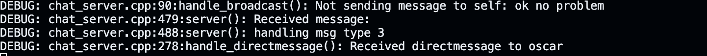
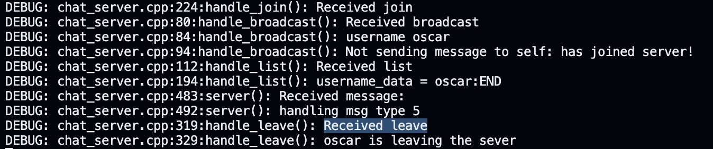
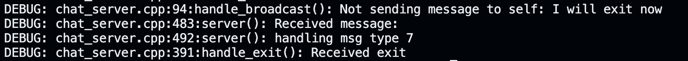
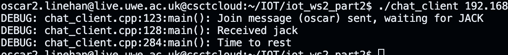

# Worksheet2_2 - OSCAR LINEHAN -21015730
# Worksheet 2_2

# PART 1

## **Task 1**

1. Fork and clone the provided Git repository: [https://gitlab.uwe.ac.uk/oc2-linehan/iot_ws2_part2](https://gitlab.uwe.ac.uk/oc2-linehan/iot_ws2_part2)
2. Navigate to the cloned repository directory containing the following files
3. To compile the program use 'make' then run `./chat_server` and  `./chat_client 192.168.1.11 1001 username` and `./chat_client 192.168.1.12 1112 username2` to run two users.

This is what it should look like depending on terminal:





### Handle join implementation

```python
void handle_join(
    online_users& online_users, std::string username, std::string mes, 
    struct sockaddr_in& client_address, uwe::socket& sock, bool& exit_loop) {
    DEBUG("Received join\n");

    // first check user not already online
    if (auto search = online_users.find(username); search != online_users.end()) {
        handle_error(ERR_USER_ALREADY_ONLINE, client_address, sock, exit_loop);
    }
    else {
        // add new user to known user map
        //struct sockaddr_in client{client_address};
        online_users[username] =  new sockaddr_in (client_address);

        // send back JACK message to client that has joined
        auto j = chat::jack_msg();
        int len = sock.sendto(reinterpret_cast<const char*>(&j), sizeof(chat::chat_message), 0,
                    reinterpret_cast<sockaddr*>(&client_address), sizeof(struct sockaddr_in));
        // send broadcast (use handle broadcast) to all other clients
        handle_broadcast(online_users, username, "has joined server!", client_address, sock, exit_loop);
        // send list message (use handle_list) set 2nd argument to "__ALL"
        handle_list(online_users, "__ALL", "", client_address, sock, exit_loop);
    }
}
```

**`handle_join`** function handles the JOIN message received from a client who wants to join the chat server. Here's a breakdown of what it does:

1. **Debug Message**: Outputs a debug message indicating that a JOIN message has been received.
2. **Check User Online**: Checks if the username provided in the JOIN message is already present in the **`online_users`** map. If the user is already online, it triggers an error mechanism 
3. **Add User to Online Users**: If the user is not already online, it adds the user to the **`online_users`** map. It associates the username with the client's address (**`sockaddr_in`**) from which the JOIN message originated. This effectively tracks which users are currently online.
4. **Send JACK Message**: Sends a JACK message back to the client that just joined. This ACK message acknowledges the successful join operation.
5. **Broadcast Join Message**: Sends a broadcast message to all other clients informing them that a new user has joined the server.
6. **Send List Message**: Sends a list message to the newly joined client, listing all the users currently online. This ensures that the new client has an up-to-date list of users.

## handle_directmessage

```python
void handle_directmessage(
    online_users& online_users, std::string username, std::string message,
    struct sockaddr_in& client_address, uwe::socket& sock, bool& exit_loop) {
    DEBUG("Received directmessage to %s\n", username.c_str());

    // Check if the recipient user exists in the online users map
    auto recipient_iter = online_users.find(username);
    if (recipient_iter != online_users.end()) {
        // Recipient user found, prepare and send direct message packet
        chat::chat_message dm_packet = chat::dm_msg(message);
        int len = sock.sendto(
            reinterpret_cast<const char*>(&dm_packet), sizeof(chat::chat_message), 0,
            reinterpret_cast<sockaddr*>(recipient_iter->second), sizeof(struct sockaddr_in));
        if (len < 0) {
            // Error sending the message
            DEBUG("Error sending direct message to %s\n", username.c_str());
            handle_error(ERR_SEND_FAILED, client_address, sock, exit_loop);
        }
    } else {
        // Recipient user not found, send an error message to the sender
        DEBUG("Recipient user %s not found\n", username.c_str());
        handle_error(ERR_USER_NOT_FOUND, client_address, sock, exit_loop);
    }
}
```

**`handle_directmessage`** function is responsible for handling direct messages sent from one client to another. Here's a breakdown of what it does:

1. **Debug Message**: Outputs a debug message indicating that a direct message to a specific user has been received.
2. **Check Recipient**: Checks if the recipient user (specified by the **`username`** parameter) exists in the **`online_users`** map. If the recipient is found, it means the recipient is currently online and available to receive messages.
3. **Prepare and Send Message**: If the recipient is found, it prepares a direct message packet (**`dm_packet`**) containing the message to be sent and sends it to the recipient's client using the **`sendto`** function. The recipient's address is obtained from the **`online_users`** map.
4. **Error Handling**: If there is an error sending the message (e.g., **`sendto`** returns a value less than 0), it triggers an error handling mechanism, possibly sending an appropriate error message to the sender.
5. **Recipient Not Found**: If the recipient user is not found in the **`online_users`** map, it indicates that the recipient is not currently online. In this case, it triggers an error handling mechanism to inform the sender that the recipient user cannot be found.

## handle_exit

```python
void handle_exit(
    online_users& online_users, std::string username, std::string, 
    struct sockaddr_in& client_address, uwe::socket& sock, bool& exit_loop) {
    
    DEBUG("Received exit\n");

    // Send exit message (chat::exit_msg()) to each user, and clear up memory for them
    for (auto& [username, user_address] : online_users) {
        // Send exit message
        chat::chat_message exit_msg = chat::exit_msg();
        int len = sock.sendto(
            reinterpret_cast<const char*>(&exit_msg), sizeof(chat::chat_message), 0,
            reinterpret_cast<sockaddr*>(user_address), sizeof(struct sockaddr_in));
        
        if (len < 0) {
            // Error sending exit message
            DEBUG("Error sending exit message to %s\n", username.c_str());
            handle_error(ERR_SEND_FAILED, client_address, sock, exit_loop);
        }

        // Clear up memory
        delete user_address;
    }

    // Clear the online users map
    online_users.clear();

    // Set exit_loop flag to true to terminate the event loop
    exit_loop = true;
}
```

1. **Debug Message**: Outputs a debug message indicating that an exit command has been received.
2. **Send Exit Message to Users**: Iterates through all the entries in the **`online_users`** map. For each user, it sends an exit message using **`chat::exit_msg()`** via the **`sendto`** function. This informs each user that the server is shutting down.
3. **Error Handling**: If there is an error sending the exit message to any user (e.g., **`sendto`** returns a value less than 0), it triggers an error handling mechanism, possibly sending an appropriate error message to the server.
4. **Clear Memory**: Deletes the dynamically allocated memory for each user's address stored in the **`online_users`** map to prevent memory leaks.
5. **Clear Online Users Map**: Clears the **`online_users`** map since all users are disconnected from the server.
6. **Set Exit Flag**: Sets the **`exit_loop`** flag to true, indicating to the server's event loop that it should terminate.

For the `chat_client` I implimented this code.

```python
switch(type) {
    case chat::EXIT: {
        DEBUG("Received Exit from GUI\n");
        // Prepare exit message and send it to the server
        chat::chat_message exit_msg = chat::exit_msg();
        int len = sock.sendto(
            reinterpret_cast<const char*>(&exit_msg), sizeof(chat::chat_message), 0,
            (sockaddr*)&server_address, sizeof(server_address));
        exit_loop = true; // Set exit flag to true to break out of the loop
        break;
    }
    case chat::LEAVE: {
        // Prepare leave message and send it to the server
        chat::chat_message leave_msg = chat::leave_msg();
        int len = sock.sendto(
            reinterpret_cast<const char*>(&leave_msg), sizeof(chat::chat_message), 0,
            (sockaddr*)&server_address, sizeof(server_address));
        exit_loop = true; // Set sent_leave flag to true
        break;
    }
    case chat::LIST: {
        DEBUG("Received LIST from GUI\n");
        // Prepare list request message and send it to the server
        chat::chat_message list_msg = chat::list_msg(username);
        int len = sock.sendto(
            reinterpret_cast<const char*>(&list_msg), sizeof(chat::chat_message), 0,
            (sockaddr*)&server_address, sizeof(server_address));
        break;
    }
    default: {
        // Handle message for direct message (DM) if the command is not recognized
        if (cmds.size() == 2) {
            // Extract recipient username and message from the command
            std::string recipient = cmds[0]; // Assuming the first part of the command is the recipient
            std::string message = cmds[1];
            // Prepare direct message and send it to the server
            chat::chat_message dm_msg = chat::dm_msg(recipient, message);
            int len = sock.sendto(
                reinterpret_cast<const char*>(&dm_msg), sizeof(chat::chat_message), 0,
                (sockaddr*)&server_address, sizeof(server_address));
        }
        break;
    }
}

```

1. **Case `chat::EXIT`**:
    
    it creates an exit message (exit_msg) using the `**chat::exit_msg()**` function. It sends the exit message to the server using the **sock.sendto** function. The **exit_loop** flag sets to true, indicating that the program should exit the loop and terminate.
    
    - **Purpose**: Handles the scenario where the user wants to exit the chat application.
    - **Actions**:
        - Outputs a debug message indicating that an exit command has been received.
        - Prepares an exit message using **`chat::exit_msg()`**.
        - Sends the exit message to the server using the **`sendto`** function.
        - Sets the **`exit_loop`** flag to true to break out of the main event loop, presumably indicating to the client that it should terminate.
2. **Case `chat::LEAVE`**:
    
     The Leave case prepares a(leave_msg) using the `**chat::leave_msg()**` function. Similar to the exit case, it sends this leave message to the server and sets the **exit_loop** flag to true.
    
    - **Purpose**: Handles the scenario where the user wants to leave the chat room or session.
    - **Actions**:
        - Prepares a leave message using **`chat::leave_msg()`**.
        - Sends the leave message to the server using the **`sendto`** function.
        - Sets the **`exit_loop`** flag to true. This might be intended to indicate that the user has sent a leave message, and further interaction with the server is unnecessary.
    1. **Case `chat::LIST`**:
        
        it prepares a list request message (list_msg) using the **chat::list_msg()** function. It then sends this list request message to the server.
        
    - **Purpose**: Handles the scenario where the user requests a list of online users.
    - **Actions**:
        - Outputs a debug message indicating that a list command has been received.
        - Prepares a list request message using **`chat::list_msg(username)`**, where **`username`** might be the client's username.
        - Sends the list request message to the server using the **`sendto`** function.
3. **Default Case**:
    
     If the command is not recognized as exit, leave, or list, it assumes it's a direct message (DM). It extracts the recipient username and message from the command and prepares a direct message (dm_msg) using the **chat::dm_msg()** function. Finally, it sends this direct message to the server.
    
    - **Purpose**: Handles messages that are not recognized as specific commands (e.g., direct messages).
    - **Actions**:
        - Checks if the message consists of two parts, assuming it represents a direct message.
        - If it does, extracts the recipient username and message from the command.
        - Prepares a direct message using **`chat::dm_msg(recipient, message)`**.
        - Sends the direct message to the server using the **`sendto`** function.



# Task 2

For task 2  I improved the implementation of the `chat_client.cpp` file. This included adding functionality for message handelling and also use threads to concurrently run servers.



**receiver_thread**

the receiver thread needs to be able to recive the message that is being sent by the server and then exit the client if the server sends the exit message.

To do this I added this code:

```python

std::pair<std::thread, Channel<chat::chat_message>> make_receiver(uwe::socket* sock) {
  auto [tx, rx] = make_channel<chat::chat_message>();
  
  std::thread receiver_thread{[](Channel<chat::chat_message> tx, uwe::socket* sock) { 
    try {
        for (;;) {
            chat::chat_message msg;
            
            // receive message from server
            int recv_len = sock->recvfrom(reinterpret_cast<char*>(&msg), sizeof(chat::chat_message), 0, nullptr, nullptr);
            if (recv_len == sizeof(chat::chat_message)) {
                    // send (tx) to main UI thread
                    tx.send(msg);
                }
            // exit receiver thread
            if (msg.type_ == chat::EXIT || (msg.type_ == chat::LACK && sent_leave)) {
                break;
            }
        }
    }
    catch(...) {
        DEBUG("caught exception\n");
    };
  }, std::move(tx), sock};

  return {std::move(receiver_thread), std::move(rx)};
}
```

**`make_receiver`** takes a pointer to a **`uwe::socket`** it calls **`make_channel<chat::chat_message>()`** to create a communication channel, which returns a pair of sender and receiver objects (**`tx`** and **`rx`** ). It creates a  thread called **`receiver_thread`**.  The thread runs in an infinite loop (**`for (;;)`**) to continuously receive messages from the server. Within the loop, it aims to receive a chat message from the server using **`sock->recvfrom()`**. If a chat message is received with a length equal to **`sizeof(chat::chat_message)`**, it sends the message to the channel (**`tx`**) to the main UI thread using **`tx.send(msg)`**. 

The loop also checks for termination. If the received message indicates that the client should exit (either explicitly through a chat message with type **`chat::EXIT`**, or if it receives a lack message **`chat::LACK`** indicating that the client should leave, and it has sent the leave message), it breaks the loop, effectively terminating the receiver thread. If any exception occurs during the execution of the receiver thread, it is caught, and a debug message is printed. Finally, the function returns a pair containing the **`receiver_thread`** and the receiver channel **`rx`**.

Now the receiver thread is implemented I started on the switch statements.

## Direct Message

I here am testing the direct message function which gives the correct output and recipient can receive the direct message.





## Leave

The leave statement sends a leave message to the server when entered.

```cpp
case chat::LEAVE: {
                                DEBUG("Received LEAVE from GUI\n"); 
                            
                                sent_leave = true;
                                chat::chat_message leave_msg = chat::leave_msg();
                                // send data
                                int len = sock.sendto(reinterpret_cast<const char*>(&leave_msg), sizeof(chat::chat_message), 0,
                                                    (sockaddr*)&server_address, sizeof(server_address));
                                break;
                            }
```

Here is the debug statment when `leave:` is inputed:



This will close the window.

## List

the list statement sends a list message to the server when received

```python
case chat::LIST: {
                                DEBUG("Received LIST from GUI\n");
                                // you need to fill in ################
                                chat::chat_message list_msg;
                                int len = sock.sendto(reinterpret_cast<const char*>(&list_msg), sizeof(chat::chat_message), 0,
                                                    (sockaddr*)&server_address, sizeof(server_address));
                                
                                break;
                            }
                            
```

## Exit

The exit statement 

```python
case chat::EXIT: { //exits everyone 
                                DEBUG("Received Exit from GUI\n");
                                chat::chat_message exit_msg = chat::exit_msg();
                                // send data
                                int len = sock.sendto(reinterpret_cast<const char*>(&exit_msg), sizeof(chat::chat_message), 0,
                                                    (sockaddr*)&server_address, sizeof(server_address));
                                break;
                            }
```

Here is the exit debug statment after `exit:` is performed:





To display ip_adddress, udp information and the type I used the command:

`/opt/iot/bin/iotdump --ip --udp --udp_header --udp_msg --chat -f packets/iotpacket_192.168.1.52_8867`

which gave me this output:

```python
type:   0       JOIN
username:       oscar3
IP:     192.168.1.13    192.168.1.52
UDP:    1113            8867    1089    40650
**oscar3**
type:   2       BROADCAST
username:       oscar3
message:        Hi
IP:     192.168.1.13    192.168.1.52
UDP:    1113            8867    1089    35489
**oscar3**
type:   2       BROADCAST
username:       oscar3
message:        I will exit now
IP:     192.168.1.13    192.168.1.52
UDP:    1113            8867    1089    12861
****
type:   7       EXIT
IP:     192.168.1.11    192.168.1.52
UDP:    1111            8867    1089    54462
```

# Task 3

implemented the group and create_group function. 

```python
case chat::CREATE_GROUP: { //this sets the parameters for the group chat.
                                DEBUG("Received GROUP from GUI\n");
                                // you need to fill in ################
                                if (cmds.size() == 2) {
                                chat::chat_message create_group_msg = chat::create_group_msg(cmds[0], cmds[1]);
                                int len = sock.sendto(reinterpret_cast<const char*>(&chat::create_group_msg), sizeof(chat::chat_message), 0,
                                                    (sockaddr*)&server_address, sizeof(server_address));
                                
                                break;
                            }
```

```cpp
/**
 * @brief Create a GROUP message 
 * @param group_name to be stored in the message
 * @param message to be stored in the message
 * @return the chat message
*/

inline chat_message create_group_msg(std::string group_name, std::string message) { //function to create group chat 
    chat_message msg;
    msg.type_=CREATE_GROUP; //set message type to create group.
    msg.username_[0]= '\0'; //group chat does not require username 

    std::size_t group_name_length = std::min(group_name.length(), static_cast<size_t>(MAX_MESSAGE_LENGTH) - 1);
    memcpy(&msg.message_[0], group_name.c_str(), group_name_length);
    msg.message_[group_name_length] = '\0';
    
    return msg;
}
```

In the ew `chat_ex.hpp` header file I added:

```python
enum chat_type {
    JOIN = 0,
    JACK,
    BROADCAST,
    DIRECTMESSAGE,
    LIST,
    LEAVE,
    LACK,
    EXIT,
    CREATE_GROUP,
    GROUP,
    ERROR,
    UNKNOWN,
};
```

2 new chat types, `CREATE_GROUP` and `GROUP.`